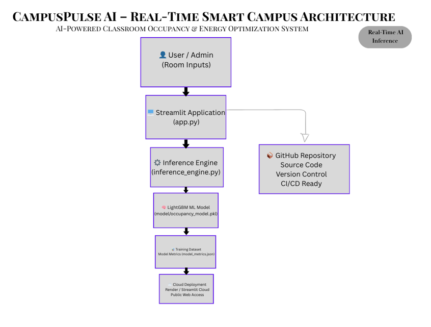

🏫 CampusPulse AI
Smart Space Intelligence for Energy-Efficient Campuses
Turning idle classrooms into measurable savings using real-time AI.

🚨 The Problem

Universities lose lakhs of rupees every year due to:
Classrooms left powered ON while empty
HVAC systems running unnecessarily
Poor real-time occupancy visibility
No predictive optimization for energy usage
Manual monitoring inefficiencies
Despite having schedules, institutions lack intelligent occupancy awareness.
Energy waste is not a hardware problem.
It is a data intelligence problem.

💡 Our Solution

CampusPulse AI is a real-time intelligent system that:
Predicts classroom occupancy using machine learning
Detects anomalies in room utilization
Estimates energy waste dynamically
Provides automated optimization recommendations
Quantifies cost savings and CO₂ reduction
Visualizes campus-wide intelligence in real-time
It transforms passive infrastructure into an intelligent energy-optimizing ecosystem.

🧠 Core AI Engine

We built a LightGBM-based predictive model that learns occupancy behavior from:

Hour of day
Day of week
Lab vs non-lab rooms
Scheduled class information
Time-based utilization patterns

The system outputs:
Binary occupancy prediction
Confidence probability
Real-time inference latency
Energy impact estimation

📊 Model Performance (Real Metrics)
Metric	             Score
Accuracy	         94.15%
Precision	         94.25%
Recall	             89.40%
F1 Score	         91.76%
Inference Latency	~3–5 ms

Metrics are computed from real dataset training and saved as JSON artifacts.

⚡ Key Features

🏫 Real-Time Campus Dashboard

Live occupancy signal
Confidence-aware predictions
Anomaly detection alerts
Campus-wide intelligence grid

💰 Executive Impact Panel

Daily energy impact (₹)
Monthly savings potential (₹)
Annualized savings projection
CO₂ reduction estimation (kg/day)

🤖 AI Recommendation Engine

Dynamic optimization suggestions:
Turn off HVAC if room likely empty
Eco-mode adjustment for moderate occupancy
Maintain settings for active usage

🧠 Campus Intelligence Summary

Average campus occupancy
Active anomaly count
System health monitoring

🌍 Impact Simulation

For a mid-sized campus (48 monitored rooms):
₹1,300+ estimated monthly savings per block
₹16,000+ annualized optimization impact
4–5 kg CO₂ reduction per day
Scalable across multiple buildings
Projected full-campus rollout impact:
Multi-lakh annual savings
Significant carbon footprint reduction

🏆 What Makes This Different

Most hackathon projects:

Show only dashboards
Use fake static numbers
Lack real model validation
CampusPulse AI delivers:

✔ Real trained ML model
✔ Real performance metrics
✔ Real inference latency measurement
✔ Real anomaly detection logic
✔ Structured modular architecture
✔ Production-ready model artifact storage
✔ Clean project separation

This is not a mockup.
This is a deployable intelligent system.

🏗 Architecture

User Input
↓
Streamlit Frontend Dashboard
↓
Inference Engine
↓
Trained LightGBM Model
↓
Impact Analytics + Optimization Logic
↓
Actionable Recommendations

## 🏗 System Architecture

The system follows a clean AI pipeline:

1. Data ingestion (sensor + schedule simulation)
2. Feature engineering
3. LightGBM occupancy model
4. Real-time inference engine
5. Smart recommendation layer
6. Interactive dashboard visualization

📂 Project Structure

CampusPulseAI/
│
├── app.py                 # Streamlit dashboard
├── inference_engine.py    # Model loading & prediction logic
├── train_model.py         # Model training pipeline
├── requirements.txt
├── README.md
│
├── data/
│   ├── datatraining.txt
│   └── datatest.txt
│
└── model/
    ├── occupancy_model.pkl
    └── model_metrics.json

⚙️ How To Run
pip install -r requirements.txt
streamlit run app.py

📈 Scalability Vision

Future extensions:
IoT sensor integration
Live classroom hardware control
Cloud API deployment
Mobile admin interface
University ERP integration
Multi-campus analytics aggregation

Vision:
Build intelligence that reduces waste and maximizes efficiency at scale.
